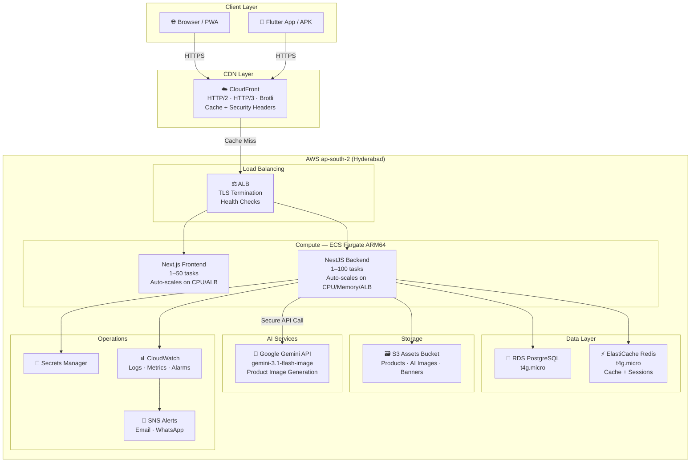

# Anjali Alankaram — Enterprise eCommerce Platform

A production-ready, enterprise-grade premium women's fashion eCommerce platform with AI-powered product image generation, elastic auto-scaling from <100 to 100,000+ concurrent users, and full-featured admin dashboard.

🌐 **Live Website**: [anjalialankaram.com](https://anjalialankaram.com)

---

## ── Architecture Overview



| Layer | Technology |
|:---|:---|
| **Backend API** | NestJS · Prisma ORM · PostgreSQL · Redis |
| **Frontend** | Next.js 14 (App Router) · TailwindCSS · Zustand |
| **Mobile** | Flutter · Riverpod + Android APK |
| **Cloud** | AWS VPC · ALB · ECS Fargate ARM64 (Spot) · RDS PostgreSQL · ElastiCache Redis · Route 53 · ACM |
| **AI** | Google Gemini gemini-3.1-flash-image (AI product images) |
| **CDN** | CloudFront (HTTP/3 + Brotli + security headers) |
| **CI/CD** | GitHub Actions (build → scan → deploy → migrate → invalidate) |
| **IaC** | Terraform (modular — vpc, alb, ecs, rds, redis, security) |

---

## ── Project Structure

```
├── /backend                 # NestJS REST API
│   ├── /src
│   │   ├── /ai-images       # ✨ AI Product Image Generation
│   │   │   ├── ai-images.module.ts
│   │   │   ├── ai-images.service.ts    # Google Gemini API + S3 session management
│   │   │   ├── ai-images.controller.ts # Secure admin endpoints
│   │   │   └── /dto                    # TypeScript DTOs
│   │   ├── /s3-cleanup      # 🧹 Automatic S3 Orphan Cleanup
│   │   │   ├── s3-cleanup.module.ts
│   │   │   └── s3-cleanup.service.ts   # Daily cron + on-delete hooks
│   │   ├── /products        # Product CRUD + S3 lifecycle hooks
│   │   ├── /uploads         # File upload controller + audit logging
│   │   └── main.ts          # Security hardened (Helmet, trust proxy, CSP)
│   └── /prisma
│       └── schema.prisma    # AiImageSession + AuditLog models + composite indexes
├── /frontend                # Next.js Web Application
│   └── /src
│       ├── /app
│       │   └── /admin
│       │       └── /products
│       │           └── page.tsx       # ✨ AI button in Edit Product modal
│       └── /components
│           └── /admin
│               └── AIImageGeneratorModal.tsx  # Premium multi-step AI modal
├── /infrastructure          # Terraform (elastic auto-scaling)
│   ├── main.tf
│   ├── variables.tf         # Auto-scaling vars (no tier system)
│   ├── s3.tf                # Lifecycle rules (AI temp 48h, products 90d→IA)
│   ├── secrets.tf           # Secrets Manager (incl. GEMINI_API_KEY)
│   └── /modules
│       ├── /ecs             # ARM64 Fargate + true elastic auto-scaling
│       ├── /vpc             # VPC + subnets
│       ├── /alb             # Application Load Balancer
│       ├── /rds             # PostgreSQL RDS
│       ├── /redis           # ElastiCache Redis
│       └── /security        # IAM + Security Groups
├── /mobile                  # Flutter Mobile App
├── /.github
│   └── /workflows
│       ├── deploy.yml       # CI/CD: build → scan → deploy → migrate → notify
│       └── terraform.yml    # IaC: validate → plan → apply (with approval gate)
└── docker-compose.yml       # Local development
```

---

## ── Feature Set

### 🛍️ Customer Features
- Product catalogue with variant system (size, colour, hex swatches)
- Image lightbox with swipe gestures and zoom
- Size guide modal (inches ↔ cm conversion)
- Wishlist (with persistent global count badge in header on both desktop and mobile BottomNav), cart, and one-page checkout
- Razorpay online payment + Cash on Delivery
- Coupon & automatic offer discounts
- GST / shipping / COD charge calculation
- Gift packaging add-on
- Product reviews — submit, star rating, verified-purchase badge
- Real-time active-viewer count on product pages
- Pincode delivery availability check
- Order tracking & history
- Google OAuth + OTP login
- PWA install prompt + Offline support (branded offline page)

### ⚙️ Admin Dashboard (`/admin`)
- **Products** — create/edit with variants, images, size guide, video
- **✨ AI Product Images** — generate professional fashion photos using model face + product image
- **Orders** — full order management, status updates, Shiprocket integration
- **Customers** — user list, details, order history
- **Reviews** — view all, search/filter, delete
- **Coupons** — create/disable discount codes
- **Offers** — auto-discount offer banners
- **Analytics** — sales charts, visitor stats, revenue overview
- **Settings** — full store configurator
- **Audit Logs** — all S3 actions, AI generations, deletions logged

### 🤖 AI Product Image Generation (Google Gemini)
1. Open any product in admin → click **✨ Create Images with AI**
2. Upload a model face image (JPG/PNG/WEBP, max 10MB)
3. Upload the product's shopping image
4. Optionally add custom instructions
5. Backend downloads S3 reference images and uploads them as inline multimodal visual data to Google Gemini (`gemini-3.1-flash-image` "Nano Banana" model).
6. AI generates **4 highly accurate professional fashion photographs** preserving the exact face and garment patterns in 4 poses:
   - Front Standing · 45° Left · 45° Right · Walking Pose
7. Review gallery — **Approve**, **Download**, or **Delete** each image
8. Approved images instantly appear in product's image gallery
9. Temp images auto-expire in 24 hours; S3 lifecycle deletes after 48 hours

### 🧹 Automatic S3 Cleanup (NEW)
- **On product delete**: All product images deleted from S3 asynchronously
- **On image replace**: Old S3 object deleted after new one is confirmed
- **On banner delete/update**: Associated S3 images deleted
- **On category delete**: Category image deleted from S3
- **Daily cron (2 AM)**: Full orphan scan — lists all S3 objects, compares against DB references, deletes unreferenced files
- Cleanup reports saved to `s3://bucket/cleanup-logs/YYYY-MM-DD.json`
- All operations logged to `AuditLog` table

### 💾 Disaster Recovery & Migration Utilities (NEW)
- **AWS Secrets Sync**: Push and merge local environment variables to AWS Secrets Manager using `sync-secrets.js` with endpoint exclusions.
- **SSM Automated Backups**: Retrieve customer accounts and store settings directly from the production database in the private VPC subnet using `fetch-production-backup.js` and SSM ExecuteCommand agents.
- **SSM Decrypted Secrets Backup**: Export decrypted backend and frontend secrets values from Secrets Manager to a secure local folder using `fetch-aws-secrets-backup.js`.
- **Fargate State Restoration**: Bulk restore customers and configuration parameters back to fresh RDS database instances from local backup JSONs using the container execution script `run-restore.js`.

---

## ── AWS Auto-Scaling Architecture

### Elastic Scaling — Zero Manual Changes Required

The platform automatically scales from 1 task to 100+ tasks based on real-time demand. **No Terraform changes needed** for any traffic level up to 100,000 concurrent users.

#### Scaling Triggers (all active simultaneously)
| Trigger | Backend | Frontend |
|:--------|:--------|:---------|
| CPU Utilization | Scale at 60% | Scale at 70% |
| Memory Utilization | Scale at 75% | — |
| ALB Requests/Target | Scale at 500 req/target | Scale at 1000 req/target |

#### Cost vs. Traffic Projections

| Concurrent Users | Backend Tasks | Frontend Tasks | Est. Monthly Cost |
|:----------------|:-------------|:--------------|:-----------------|
| < 100 (startup) | 1 (Spot) | 1 (Spot) | **₹3,200–₹3,800** |
| 500 | 2–3 | 1–2 | ₹5,500–₹7,000 |
| 1,000 | 4–5 | 2–3 | ₹9,000–₹12,000 |
| 5,000 | 10–12 | 5–6 | ₹22,000–₹30,000 |
| 10,000 | 18–22 | 8–10 | ₹40,000–₹55,000 |
| 50,000 | 50–60 | 20–25 | ₹1,20,000–₹1,60,000 |
| 100,000 | 90–100 | 40–50 | ₹2,40,000–₹3,00,000 |

#### Cost Optimization Features
- **ARM64 Graviton2**: ~20% cheaper than x86 Fargate
- **FARGATE_SPOT**: ~70% cheaper for additional tasks beyond 1 guaranteed on-demand
- **S3 Lifecycle tiering**: Products → S3-IA after 90 days, → Glacier after 365 days
- **ECR Lifecycle**: Delete untagged images after 1 day, keep last 10 production images
- **CloudWatch Logs**: 14-day retention (vs. default 30)
- **S3 Encryption**: Bucket Key reduces encryption costs by ~99%

---

## ── Getting Started (Local Development)

### Prerequisites
- Node.js 20+
- Docker & Docker Compose
- Flutter SDK (for mobile only)

### Steps

1. **Start Database and Redis**
   ```bash
   docker-compose up -d postgres redis
   ```

2. **Configure & Start Backend**
   ```bash
   cd backend
   cp .env.example .env
   # Fill in DB credentials, JWT_SECRET, and API keys
   # Add GEMINI_API_KEY for AI image generation
   npm install
   npx prisma db push
   npm run start:dev
   ```
   API: `http://localhost:3000`
   Swagger: `http://localhost:3000/api/docs`

3. **Configure & Start Frontend**
   ```bash
   cd ../frontend
   cp .env.local.example .env.local   # Set NEXT_PUBLIC_API_URL
   npm install
   npm run dev
   ```
   Frontend: `http://localhost:4000`

---

## ── Production Deployment (From Scratch)

### Step 1: Configure GitHub Secrets
Add these secrets to your GitHub repository (`Settings → Secrets → Actions`):

| Secret | Description |
|:-------|:------------|
| `AWS_ACCESS_KEY_ID` | AWS IAM access key |
| `AWS_SECRET_ACCESS_KEY` | AWS IAM secret key |
| `ECR_REGISTRY` | ECR registry URL (e.g. `123456789.dkr.ecr.ap-south-2.amazonaws.com`) |
| `CLOUDFRONT_DISTRIBUTION_ID` | CloudFront distribution ID (optional) |
| `TF_VAR_DB_PASSWORD` | Database password for Terraform |
| `MSG91_AUTH_KEY` | For deployment WhatsApp notifications |
| `DEPLOY_NOTIFY_PHONE` | Phone number for deployment notifications |

### Step 2: Provision Infrastructure
```bash
cd infrastructure
terraform init
terraform apply   # Provisions everything: VPC, ALB, ECS, RDS, Redis, S3
```
> ⚠️ First apply will take ~5 minutes. Note the outputs (ECR URLs, ALB DNS, Secrets ARN).

### Step 3: Push Secrets to AWS Secrets Manager
```bash
cd backend
npm run secrets:push   # Reads backend/.env and pushes to Secrets Manager
```
> 🔑 **Required**: Also add `GEMINI_API_KEY` to the secret for AI image generation.

### Step 4: Push Code to main Branch
```bash
git push origin main
```
> GitHub Actions automatically builds ARM64 Docker images → scans with Trivy → deploys backend → runs Prisma migrations → deploys frontend → invalidates CloudFront → sends WhatsApp notification.

### Step 5: Domain & DNS
- Point `anjalialankaram.com` to the ALB DNS name (or CloudFront)
- ACM certificate is auto-provisioned and validated via Route53

### Manual ECS Force Deploy (if needed)
```bash
# Backend
aws ecs update-service --cluster anjali-alankaram-cluster \
  --service anjali-alankaram-backend-service \
  --force-new-deployment --region ap-south-2

# Frontend
aws ecs update-service --cluster anjali-alankaram-cluster \
  --service anjali-alankaram-frontend-service \
  --force-new-deployment --region ap-south-2
```

### Database Schema Updates
Schema updates are applied **automatically on every deployment** via the CI/CD pipeline (Prisma `db push` via ECS Run Task).

---

## ── CI/CD Pipeline

```
Push to main ──► Build ARM64 Docker Images (backend + frontend)
                ──► Trivy Security Scan (CRITICAL/HIGH vulnerabilities reported)
                ──► Push to ECR (tagged with git SHA + latest)
                ──► Deploy Backend (ECS rolling update, circuit breaker + auto-rollback)
                ──► Run DB Migrations (ECS Run Task: prisma db push)
                ──► Deploy Frontend (ECS rolling update)
                ──► Invalidate CloudFront Cache
                ──► Send WhatsApp deployment notification
```

            Merge to main ──► terraform apply (requires GitHub Environment approval)
```

---

## ── Enterprise Architecture Enhancements

For true large-scale operations, the platform integrates the following enterprise-grade designs and future implementation specs:

### 1. Multi-Region Disaster Recovery (DR)
The platform is designed around an **Active-Passive Multi-Region DR** architecture to protect against major AWS region outages:
- **Primary Region:** Hyderabad (`ap-south-2`) | **DR Region:** Mumbai (`ap-south-1`)
- **Route 53 DNS Failover:** Configured with active-passive failover routing policies and health checks tracking the primary ALB.
- **S3 Cross-Region Replication:** Asynchronous S3 replication copies product assets and reference photos across regions.
- **RDS Cross-Region Replicas:** Continuous PostgreSQL logical replication to `ap-south-1`. In the event of primary region failure, an AWS Lambda promotions script promotes the Mumbai read-replica to primary.
- **CloudFront Origin Groups:** Configure fallback origin routing groups to redirect traffic directly to Mumbai ALB if Hyderabad ALB times out (502/503/504 errors).
- **RTO & RPO Objectives:**
  - **Recovery Time Objective (RTO):** < 10 minutes (automated replica promotion and DNS switch).
  - **Recovery Point Objective (RPO):** < 1 minute (committed database state replication lag).

### 2. AI Image Cost Protection & Budget Safeguards
To prevent excessive Gemini API billing and token drainage, a multi-tier budget firewall is implemented:
- **Daily & Monthly Budgets:** Hard limits stored in PostgreSQL/Redis (e.g. ₹5,000 daily maximum, ₹50,000 monthly maximum). When reached, further calls to `generateImages` are blocked with a `403 Request Denied` exception.
- **Per-Admin Quotas:** Daily token generation caps mapped to specific administrator accounts (e.g. max 50 images per admin per day).
- **Queue Limits:** SQS max concurrent worker run limits to avoid concurrent generation bursts exceeding API rate limits.
- **Usage Analytics:** Cost tracking dashboard showing monthly Gemini credits spent and budget projection models.

### 3. Customer Experience (CX) Personalization
Real-time personalized navigation features optimized for fast retrieval:
- **Recently Viewed Products:** Stored per-user in Redis Sorted Sets (`zset`), capped at 10 items, providing sub-millisecond retrieval.
- **Personalized Recommendations:** Tag-based relevance calculations comparing product categories, tags, and material.
- **Trending Products:** A Redis counter keeps track of views on products over a sliding window of 24 hours, sorting the most popular sarees dynamically.
- **Popular Searches:** Autocomplete search suggestion indices cached in Meilisearch.

### 4. Enterprise Inventory Protection & Overselling Prevention
To safeguard inventory during high-traffic flash sales (such as festive saree launches):
- **Atomic Stock Reservation:** Uses PostgreSQL pessimistic locking (`SELECT ... FOR UPDATE`) during database transactions to ensure two customers cannot checkout the same stock SKU concurrently.
- **Checkout Reservation Windows:** When an item is added to the cart, the stock is reserved for 15 minutes. This is tracked using Redis keys with expirations (`inventory:hold:sku:cartId`).
- **Automated Stock Release:** A background BullMQ job listens to expired Redis keys and automatically returns the stock to database availability if the cart checkout is abandoned.
- **Idempotence:** Frontends generate a unique `Idempotency-Key` UUID for every checkout post request, preventing duplicate order placement on double clicks.

### 5. Highly Reliable Payment Webhook Processor
Handles Razorpay webhook payloads with enterprise-grade resilience:
- **Idempotency Ledger:** Saves processed webhook IDs to a `WebhookReceived` table with a unique constraint. Duplicate webhook invocations are ignored.
- **Queue-Backed Processing:** Webhooks write raw payloads to a BullMQ task queue and return a `200 OK` instantly, preventing ALB timeouts.
- **Cryptographic Signature Verification:** Enforces SHA256 HMAC signature validation on all incoming webhook HTTP headers.
- **Two-Phase Reconciliation:** A cron job runs every hour to cross-reference incomplete orders in the DB with Razorpay API status, recovering from missed webhook failures automatically.

### 6. Business Analytics Engine
A high-performance metrics generator using PostgreSQL materialized views to compile critical storefront KPIs:
- **Hourly Refreshed Materialized Views:** Compiles metrics such as:
  - **Conversion Rate:** Completed orders divided by unique sessions.
  - **Abandoned Carts:** Carts created but not converted after 2 hours.
  - **Average Order Value (AOV):** Sum of revenue divided by order counts.
  - **Customer Lifetime Value (LTV):** Cumulative revenue of returning customers.
- **Cached Dashboards:** Query metrics from the materialized views with Redis caching (5-minute TTL) to avoid expensive database tables scans on dashboard loading.

### 7. Bulk Admin Productivity Tools
Enables rapid administrative tasks on product catalog lines:
- **CSV Import/Export Engine:** Stream-based file parser to upload or update thousands of products and stock variants without memory exhaustion.
- **Prisma Batch Updates:** Executes database updates in bulk transactions for quick price edits, category reassignments, and warehouse inventory updates.
- **Bulk AI Generation:** Enqueues multiple product photos to the SQS queue for concurrent model background rendering.

### 8. Internationalization (i18n) & Multi-Currency Architecture
Prepares the platform for future global markets:
- **Multi-Currency Converter:** Support for USD/INR transactions. Currency exchange rates are refreshed daily from Open Exchange Rates and cached in Redis.
- **Multi-Language Dictionaries:** Client-side translation strings for English and Telugu.
- **Dynamic Tax Configuration:** Pluggable tax rates (GST for domestic, custom duties for international checkout).

### 9. Automated Security & Compliance Scanning
Maintains platform security compliance through the integration of static and runtime scanning:
- **Dependency Scanning:** Automated `npm audit` and Snyk checks in the CI/CD pipeline on every pull request.
- **Trivy Container Scan:** Scans the build layers of Next.js and NestJS images for OS-level vulnerabilities.
- **Secret Scanning:** GitGuardian/TruffleHog checks in GitHub Actions to prevent AWS keys or API credentials from leaking.

### 10. Unified Platform Health Score Dashboard
A master dashboard consolidating operational data into a single health score:
$$\text{Health Score} = 0.25 \times \text{Availability} + 0.20 \times \text{Security} + 0.15 \times \text{Performance} + 0.15 \times \text{Cache Efficiency} + 0.15 \times \text{Error Rate} + 0.10 \times \text{Budget Compliance}$$
- **KPI Metrics track:**
  - **Availability:** Ping and health status checks of ECS services.
  - **Security:** Vulnerability count and SSL certificate expiry.
  - **Performance:** CloudFront cache-hit ratio (>90%) and average API response time (<100ms).
  - **Budget Compliance:** AWS cost thresholds and Gemini token usage.

---

## ── Security Architecture

| Layer | Control |
|:------|:--------|
| **Network** | VPC with security groups (ALB → ECS → RDS/Redis only) |
| **TLS** | ACM certificates, HSTS with preload, HTTP→HTTPS redirect |
| **CSP** | Strict Content-Security-Policy via Helmet |
| **Headers** | X-Frame-Options, X-Content-Type-Options, Referrer-Policy |
| **Auth** | JWT (HS256) + Google OAuth + OTP via MSG91 |
| **Secrets** | All keys in AWS Secrets Manager — never in code or env files |
| **Rate Limiting** | Configurable per-IP rate limiting via NestJS ThrottlerModule |
| **File Upload** | MIME type whitelist, 15MB size limit, S3 key prefix validation |
| **AI Endpoints** | Admin-only (RBAC guard), session-based, 24h expiry |
| **Audit Logging** | All S3 mutations and AI operations logged to `audit_logs` table |
| **Container Scan** | Trivy scans every Docker image before deployment |
| **IAM** | Least-privilege ECS task role (S3 bucket only, CloudWatch, Secrets) |
| **Encryption** | S3 AES-256 encryption, RDS encryption at rest |

---

## ── Database Schema Notes

The backend uses **Prisma DB Push** in production — applied automatically on every deployment via `prisma db push`. This ensures schema is always in sync without manual migration files.

### Recent Schema Additions
| Model / Field | Type | Purpose |
|:------|:------|:------|
| `AiImageSession` | New model | AI generation sessions — stores face/product refs, generated image keys, session status, expiry |
| `AuditLog` | New model | All S3 and AI operations logged for audit trail |
| `Product.@@index([status, isFeatured])` | Composite index | Faster featured products query |
| `Product.@@index([categoryId, status])` | Composite index | Faster category product listing |
| `Order.@@index([userId, status])` | Composite index | Faster user order history |
| `ProductVariant.@@index([productId, isActive])` | Composite index | Faster variant lookups |

---

## ── Alerts & Monitoring

- **CloudWatch**: ECS CPU/Memory, RDS connections, ALB 5xx error rates, running task counts, database free storage space
- **SNS + Lambda (SES HTML Email)**: Alerts trigger an email Lambda that translates CloudWatch metrics into branded HTML emails sent to `jagadishvarma99@gmail.com` via Amazon SES
- **SNS + Lambda (WhatsApp Alerts)**: Alerts trigger a WhatsApp Lambda that sends immediate push notifications (using CallMeBot API) to `+91 7032492775`
- **Deployment Alerts**: WhatsApp notification on every deployment (success or failure) via MSG91 template outbound messaging

---

## ── Changelog

| Date | Change |
|:-----|:-------|
| Jul 2026 | 🤖 AI Image Generation — Migrated from OpenAI to Google Gemini (`gemini-3.1-flash-image` "Nano Banana" model) with multimodal inline references |
| Jul 2026 | 🔐 AWS Secrets Manager — Synced Gemini API credentials |
| Jul 2026 | 📋 Login & OTP Errors — Fixed interceptor page-reload bug and added Resend OTP button |
| Jul 2026 | 👑 Admin Dashboard Greeting — Dynamically displays current logged-in user name |
| Jul 2026 | 🚨 AWS Alerts & Monitoring — Configured CloudWatch Alarms with Lambdas for HTML SES emails and CallMeBot WhatsApp alerts |
| Jul 2026 | 🧹 Automatic S3 orphan cleanup — daily cron + on-delete lifecycle hooks |
| Jul 2026 | 🚀 CI/CD Pipeline — GitHub Actions build → scan → deploy → migrate → notify |
| Jul 2026 | ⚡ True elastic auto-scaling — 1 to 100 tasks, no manual tier changes |
| Jul 2026 | 🏗️ ARM64 Fargate — 20% cost reduction with Graviton2 |
| Jul 2026 | 🔒 Security hardening — CSP, HSTS, trust proxy, referrer policy |
| Jul 2026 | 💾 S3 lifecycle rules — temp AI images (48h), products (90d → IA → Glacier) |
| Jul 2026 | 📋 AuditLog model — all S3 and AI operations tracked |
| Jul 2026 | 🗄️ Composite indexes — 5 new DB indexes for common query patterns |
| Jul 2026 | PWA name fixed to "Anjali Alankaram" on Android install & iOS home screen |
| Jul 2026 | Service Worker — offline support with branded `offline.html` page |
| Jul 2026 | Admin Reviews dashboard — view all, search, filter by rating, delete |
